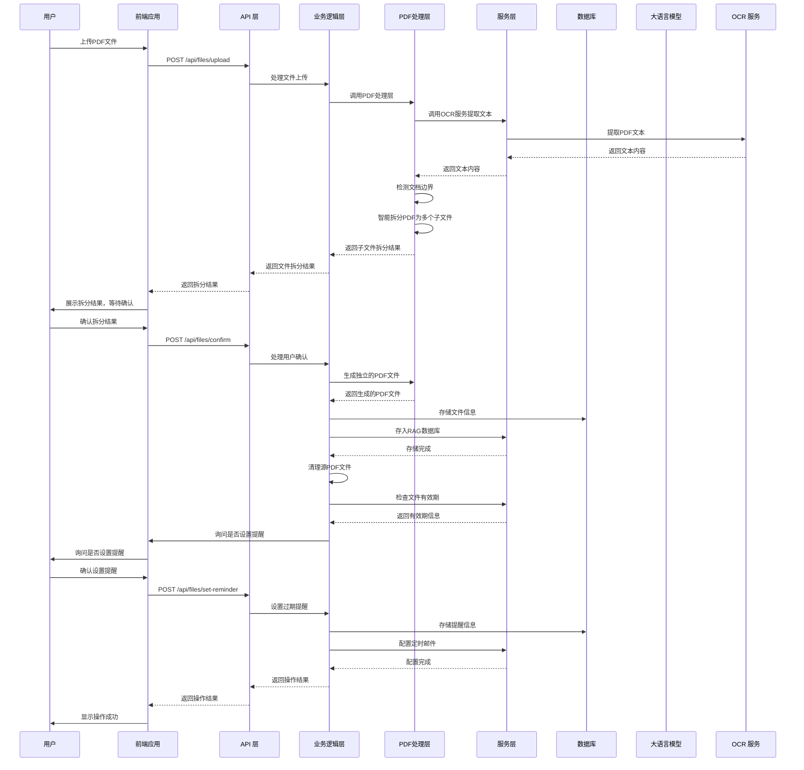
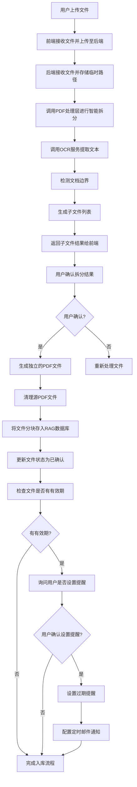
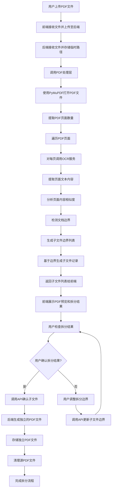
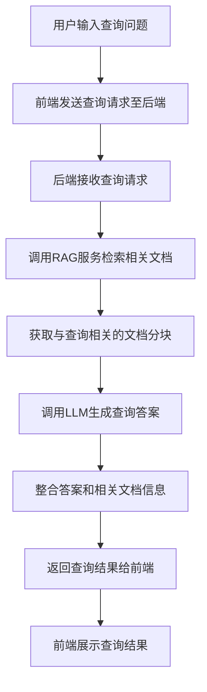
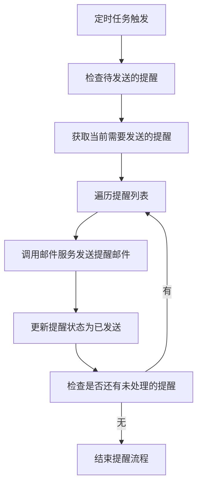
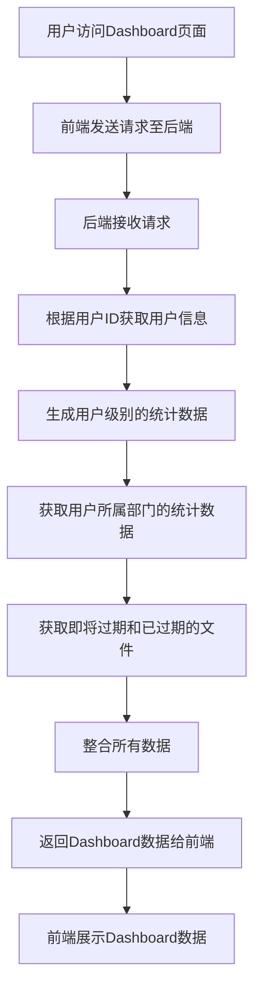

# Ai-FileManager 系统设计文档

## 1. 系统概述

Ai-FileManager 是一个基于 Python 和 Langchain 实现的文档智能管家系统，通过大语言模型和 OCR 技术，实现对 PDF 文档的智能处理、存储、检索和管理。系统提供了文件入库、文档查询、数据可视化和过期提醒等核心功能，旨在为用户提供高效、智能的文档管理解决方案。

### 1.1 系统目标

- 实现 PDF 文档的智能解析和文本提取
- 提供基于自然语言的文档查询能力
- 支持文档的结构化管理和过期提醒
- 实现用户和部门级别的文档数据可视化
- 构建安全、高效的文档管理流程

### 1.2 核心功能

1. **文件入库**：拆分文件、用户确认、存入 RAG 数据库、设置过期提醒
2. **文档查询**：通过自然语言查询，RAG 搜索相关文档并返回答案
3. **Dashboard 展示**：展示用户和部门相关的文档数据，包括即将过期和已过期文档
4. **过期提醒**：自动识别文件有效期，生成提醒内容并通过邮件通知用户
5. **PDF智能拆分**：对扫描件PDF文件进行智能拆分，识别单个PDF中的多个独立文件内容，形成多个独立的PDF文件并支持人工确认

## 2. 技术栈选型

| 类别 | 技术/框架 | 版本 | 用途 |
|------|-----------|------|------|
| 后端语言 | Python | 3.10+ | 系统核心逻辑实现 |
| 前端框架 | React | 18.2+ | 前端界面开发 |
| 前端状态管理 | Redux Toolkit | 1.9+ | 前端状态管理 |
| 前端样式 | Tailwind CSS | 3.3+ | 响应式 UI 设计 |
| API 框架 | FastAPI | 0.104+ | 后端 API 开发 |
| 数据库 | PostgreSQL | 15.0+ | 结构化数据存储 |
| 向量数据库 | Pinecone | 最新版 | RAG 文档向量存储 |
| 大语言模型 | OpenAI GPT-4 | 最新版 | 文本总结和结构化信息生成 |
| OCR 模型 | Google Cloud Vision | 最新版 | PDF 文本提取 |
| PDF 处理 | PyPDF2 + pdfplumber | 最新版 | PDF 文档结构分析和页面提取 |
| PDF 拆分 | PyMuPDF | 1.23+ | PDF 文件拆分和合并 |
| 邮件服务 | SMTP + SendGrid | 最新版 | 过期提醒邮件发送 |
| 认证 | JWT | - | 用户认证和授权 |
| 容器化 | Docker | 20.10+ | 应用部署和环境隔离 |

## 3. 系统架构

### 3.1 整体架构

Ai-FileManager 采用前后端分离的架构设计，后端提供 RESTful API 接口，前端通过 HTTP 请求与后端交互。系统分为以下几个核心层次：

1. **前端层**：React 应用，负责用户界面展示和交互
2. **API 层**：FastAPI 应用，处理 HTTP 请求和响应
3. **业务逻辑层**：实现核心业务功能，如文件处理、文档查询、过期提醒等
4. **PDF处理层**：专门处理扫描件PDF的智能拆分、边界检测和内容提取
5. **数据层**：包括 PostgreSQL 关系型数据库和 Pinecone 向量数据库
6. **外部服务层**：与大语言模型、OCR 服务、邮件服务等外部系统交互

### 3.2 模块划分

| 模块 | 主要职责 | 文件位置 |
|------|----------|----------|
| **api** | API 接口定义和路由 | backend/app/api/ |
| **core** | 核心业务逻辑 | backend/app/core/ |
| **pdf** | PDF 智能拆分和处理 | backend/app/pdf/ |
| **services** | 外部服务集成 | backend/app/services/ |
| **models** | 数据模型定义 | backend/app/models/ |
| **schemas** | 请求和响应数据结构 | backend/app/schemas/ |
| **utils** | 工具函数 | backend/app/utils/ |
| **frontend** | 前端应用 | frontend/ |

### 3.3 数据流图



## 4. 数据模型设计

### 4.1 数据库表结构

#### 4.1.1 users 表

| 字段名 | 数据类型 | 约束 | 描述 |
|--------|----------|------|------|
| `id` | `SERIAL` | `PRIMARY KEY` | 用户ID |
| `username` | `VARCHAR(255)` | `UNIQUE NOT NULL` | 用户名 |
| `email` | `VARCHAR(255)` | `UNIQUE NOT NULL` | 邮箱地址 |
| `password_hash` | `VARCHAR(255)` | `NOT NULL` | 哈希后的密码 |
| `department_id` | `INTEGER` | `REFERENCES departments(id)` | 所属部门ID |
| `created_at` | `TIMESTAMP` | `DEFAULT CURRENT_TIMESTAMP` | 创建时间 |
| `updated_at` | `TIMESTAMP` | `DEFAULT CURRENT_TIMESTAMP` | 更新时间 |

#### 4.1.2 departments 表

| 字段名 | 数据类型 | 约束 | 描述 |
|--------|----------|------|------|
| `id` | `SERIAL` | `PRIMARY KEY` | 部门ID |
| `name` | `VARCHAR(255)` | `UNIQUE NOT NULL` | 部门名称 |
| `created_at` | `TIMESTAMP` | `DEFAULT CURRENT_TIMESTAMP` | 创建时间 |
| `updated_at` | `TIMESTAMP` | `DEFAULT CURRENT_TIMESTAMP` | 更新时间 |

#### 4.1.3 files 表

| 字段名 | 数据类型 | 约束 | 描述 |
|--------|----------|------|------|
| `id` | `SERIAL` | `PRIMARY KEY` | 文件ID |
| `user_id` | `INTEGER` | `REFERENCES users(id)` | 上传用户ID |
| `department_id` | `INTEGER` | `REFERENCES departments(id)` | 所属部门ID |
| `original_filename` | `VARCHAR(255)` | `NOT NULL` | 原始文件名 |
| `file_path` | `VARCHAR(255)` | `NOT NULL` | 文件存储路径 |
| `vector_store_id` | `VARCHAR(255)` | `NOT NULL` | RAG数据库存储ID |
| `status` | `VARCHAR(50)` | `NOT NULL` | 文件状态（uploaded, confirmed, processed） |
| `valid_until` | `TIMESTAMP` | `NULL` | 有效期截止时间 |
| `reminder_set` | `BOOLEAN` | `DEFAULT FALSE` | 是否已设置提醒 |
| `created_at` | `TIMESTAMP` | `DEFAULT CURRENT_TIMESTAMP` | 创建时间 |
| `updated_at` | `TIMESTAMP` | `DEFAULT CURRENT_TIMESTAMP` | 更新时间 |

#### 4.1.4 file_chunks 表

| 字段名 | 数据类型 | 约束 | 描述 |
|--------|----------|------|------|
| `id` | `SERIAL` | `PRIMARY KEY` | 分块ID |
| `file_id` | `INTEGER` | `REFERENCES files(id)` | 所属文件ID |
| `chunk_content` | `TEXT` | `NOT NULL` | 分块内容 |
| `chunk_index` | `INTEGER` | `NOT NULL` | 分块索引 |
| `vector_id` | `VARCHAR(255)` | `NOT NULL` | 向量存储ID |
| `created_at` | `TIMESTAMP` | `DEFAULT CURRENT_TIMESTAMP` | 创建时间 |

#### 4.1.5 reminders 表

| 字段名 | 数据类型 | 约束 | 描述 |
|--------|----------|------|------|
| `id` | `SERIAL` | `PRIMARY KEY` | 提醒ID |
| `file_id` | `INTEGER` | `REFERENCES files(id)` | 关联文件ID |
| `user_id` | `INTEGER` | `REFERENCES users(id)` | 提醒用户ID |
| `remind_at` | `TIMESTAMP` | `NOT NULL` | 提醒时间 |
| `status` | `VARCHAR(50)` | `NOT NULL` | 提醒状态（pending, sent, cancelled） |
| `created_at` | `TIMESTAMP` | `DEFAULT CURRENT_TIMESTAMP` | 创建时间 |
| `updated_at` | `TIMESTAMP` | `DEFAULT CURRENT_TIMESTAMP` | 更新时间 |

### 4.2 向量数据库设计

#### 4.2.1 Pinecone 索引结构

- **索引名称**：ai-filemanager-docs
- **维度**：1536（对应 OpenAI Embedding 模型维度）
- **相似度度量**：cosine
- **命名空间**：按部门 ID 划分，确保数据隔离

#### 4.2.2 向量存储元数据

| 元数据字段 | 类型 | 描述 |
|------------|------|------|
| `file_id` | `integer` | 文件ID |
| `chunk_id` | `integer` | 分块ID |
| `user_id` | `integer` | 上传用户ID |
| `department_id` | `integer` | 所属部门ID |
| `created_at` | `timestamp` | 创建时间 |
| `valid_until` | `timestamp` | 有效期截止时间 |

## 5. API 接口设计

### 5.1 认证相关接口

| API路径 | 方法 | 模块/文件 | 类型 | 功能描述 | 请求体 (JSON) | 成功响应 (200 OK) |
|---------|------|-----------|------|----------|--------------|-------------------|
| `/api/auth/register` | `POST` | `api/auth.py` | `Router` | 用户注册 | `{"username": "...", "email": "...", "password": "...", "department_id": 1}` | `{"id": 1, "username": "...", "email": "...", "department_id": 1}` |
| `/api/auth/login` | `POST` | `api/auth.py` | `Router` | 用户登录 | `{"email": "...", "password": "..."}` | `{"access_token": "...", "token_type": "bearer", "user": {"id": 1, "username": "...", "email": "..."}}` |
| `/api/auth/me` | `GET` | `api/auth.py` | `Router` | 获取当前用户信息 | N/A | `{"id": 1, "username": "...", "email": "...", "department_id": 1}` |

### 5.2 文件管理接口

| API路径 | 方法 | 模块/文件 | 类型 | 功能描述 | 请求体 (JSON) | 成功响应 (200 OK) |
|---------|------|-----------|------|----------|--------------|-------------------|
| `/api/files/upload` | `POST` | `api/files.py` | `Router` | 上传文件 | `multipart/form-data` | `{"file_id": 1, "chunks": [{"id": 1, "content": "...", "index": 0}], "valid_until": "2023-12-31T23:59:59"}` |
| `/api/files/confirm` | `POST` | `api/files.py` | `Router` | 确认文件拆分 | `{"file_id": 1, "confirmed": true}` | `{"status": "success", "message": "文件已确认并入库"}` |
| `/api/files/set-reminder` | `POST` | `api/files.py` | `Router` | 设置过期提醒 | `{"file_id": 1, "remind_days_before": 7}` | `{"status": "success", "message": "提醒已设置"}` |
| `/api/files` | `GET` | `api/files.py` | `Router` | 获取文件列表 | N/A | `[{"id": 1, "original_filename": "...", "status": "...", "valid_until": "...", "reminder_set": true}]` |
| `/api/files/{file_id}` | `GET` | `api/files.py` | `Router` | 获取文件详情 | N/A | `{"id": 1, "original_filename": "...", "file_path": "...", "status": "...", "valid_until": "...", "chunks": [...]}` |
| `/api/files/{file_id}` | `DELETE` | `api/files.py` | `Router` | 删除文件 | N/A | `{"status": "success", "message": "文件已删除"}` |

### 5.3 文档查询接口

| API路径 | 方法 | 模块/文件 | 类型 | 功能描述 | 请求体 (JSON) | 成功响应 (200 OK) |
|---------|------|-----------|------|----------|--------------|-------------------|
| `/api/query` | `POST` | `api/query.py` | `Router` | 文档查询 | `{"query": "...", "department_id": 1}` | `{"answer": "...", "relevant_docs": [{"file_id": 1, "file_name": "...", "chunk_content": "..."}]}` |

### 5.4 Dashboard 接口

| API路径 | 方法 | 模块/文件 | 类型 | 功能描述 | 请求体 (JSON) | 成功响应 (200 OK) |
|---------|------|-----------|------|----------|--------------|-------------------|
| `/api/dashboard/user` | `GET` | `api/dashboard.py` | `Router` | 获取用户Dashboard数据 | N/A | `{"total_files": 10, "expired_files": 2, "expiring_soon_files": 3, "recent_uploads": [...]}` |
| `/api/dashboard/department` | `GET` | `api/dashboard.py` | `Router` | 获取部门Dashboard数据 | `{"department_id": 1}` | `{"total_files": 50, "expired_files": 5, "expiring_soon_files": 8, "user_stats": [...]}` |

### 5.5 部门管理接口

| API路径 | 方法 | 模块/文件 | 类型 | 功能描述 | 请求体 (JSON) | 成功响应 (200 OK) |
|---------|------|-----------|------|----------|--------------|-------------------|
| `/api/departments` | `GET` | `api/departments.py` | `Router` | 获取部门列表 | N/A | `[{"id": 1, "name": "..."}]` |
| `/api/departments` | `POST` | `api/departments.py` | `Router` | 创建部门 | `{"name": "..."}` | `{"id": 1, "name": "..."}` |
| `/api/departments/{id}` | `PUT` | `api/departments.py` | `Router` | 更新部门 | `{"name": "..."}` | `{"id": 1, "name": "..."}` |
| `/api/departments/{id}` | `DELETE` | `api/departments.py` | `Router` | 删除部门 | N/A | `{"status": "success", "message": "部门已删除"}` |

## 6. 前端组件结构

### 6.1 整体结构

```
frontend/
├── public/
├── src/
│   ├── assets/
│   ├── components/
│   │   ├── common/
│   │   ├── auth/
│   │   ├── files/
│   │   ├── query/
│   │   ├── dashboard/
│   │   └── departments/
│   ├── pages/
│   │   ├── AuthPage.jsx
│   │   ├── FilesPage.jsx
│   │   ├── QueryPage.jsx
│   │   ├── DashboardPage.jsx
│   │   └── DepartmentsPage.jsx
│   ├── services/
│   ├── store/
│   ├── utils/
│   ├── App.jsx
│   ├── index.jsx
│   └── routes.jsx
├── package.json
└── tailwind.config.js
```

### 6.2 核心组件

#### 6.2.1 认证组件

| 组件名 | 文件路径 | 功能描述 |
|--------|----------|----------|
| `LoginForm` | `components/auth/LoginForm.jsx` | 用户登录表单 |
| `RegisterForm` | `components/auth/RegisterForm.jsx` | 用户注册表单 |
| `AuthLayout` | `components/auth/AuthLayout.jsx` | 认证页面布局 |

#### 6.2.2 文件管理组件

| 组件名 | 文件路径 | 功能描述 |
|--------|----------|----------|
| `FileUploader` | `components/files/FileUploader.jsx` | 文件上传组件 |
| `FileList` | `components/files/FileList.jsx` | 文件列表展示 |
| `FileDetail` | `components/files/FileDetail.jsx` | 文件详情展示 |
| `FileChunks` | `components/files/FileChunks.jsx` | 文件分块展示 |
| `ReminderSetting` | `components/files/ReminderSetting.jsx` | 过期提醒设置 |
| `PDFViewer` | `components/files/PDFViewer.jsx` | PDF预览组件 |

#### 6.2.3 文档查询组件

| 组件名 | 文件路径 | 功能描述 |
|--------|----------|----------|
| `QueryForm` | `components/query/QueryForm.jsx` | 查询表单 |
| `QueryResult` | `components/query/QueryResult.jsx` | 查询结果展示 |
| `RelevantDocs` | `components/query/RelevantDocs.jsx` | 相关文档展示 |

#### 6.2.4 Dashboard 组件

| 组件名 | 文件路径 | 功能描述 |
|--------|----------|----------|
| `DashboardLayout` | `components/dashboard/DashboardLayout.jsx` | Dashboard 布局 |
| `StatsCard` | `components/dashboard/StatsCard.jsx` | 统计数据卡片 |
| `FileStatusChart` | `components/dashboard/FileStatusChart.jsx` | 文件状态图表 |
| `ExpiryTimeline` | `components/dashboard/ExpiryTimeline.jsx` | 过期时间线 |
| `RecentUploads` | `components/dashboard/RecentUploads.jsx` | 最近上传文件 |

#### 6.2.5 部门管理组件

| 组件名 | 文件路径 | 功能描述 |
|--------|----------|----------|
| `DepartmentList` | `components/departments/DepartmentList.jsx` | 部门列表展示 |
| `DepartmentForm` | `components/departments/DepartmentForm.jsx` | 部门创建/编辑表单 |

## 7. 后端模块设计

### 7.1 核心模块

#### 7.1.1 文件处理模块

**功能**：处理文件上传、拆分、确认和入库流程

**文件**：`backend/app/core/file_processor.py`

**主要函数**：
- `process_uploaded_file(file)`: 处理上传的文件，调用 OCR 服务提取文本
- `split_file_content(content)`: 拆分文件内容为多个分块
- `confirm_file_chunks(file_id, confirmed)`: 确认文件分块，完成入库操作
- `store_in_rag(file_id, chunks)`: 将文件分块存入 RAG 数据库
- `check_file_expiry(file_id)`: 检查文件是否有有效期

#### 7.1.2 PDF处理模块

**功能**：处理扫描件PDF的智能拆分、边界检测和内容提取

**文件**：`backend/app/pdf/pdf_splitter.py`

**主要函数**：
- `split_pdf(file_path)`: 智能拆分PDF文件，识别多个独立文档
- `detect_document_boundaries(text_pages)`: 检测文档边界，基于内容分析
- `extract_text_from_pdf(file_path)`: 从PDF中提取文本内容
- `generate_subfiles(parent_file_id, boundaries)`: 基于边界生成子文件
- `cleanup_source_file(file_path)`: 清理源PDF文件

#### 7.1.3 文档查询模块

**功能**：处理用户的文档查询请求，通过 RAG 搜索相关文档并生成答案

**文件**：`backend/app/core/query_processor.py`

**主要函数**：
- `process_query(query, department_id)`: 处理查询请求
- `search_relevant_docs(query, department_id)`: 搜索相关文档
- `generate_answer(query, relevant_docs)`: 生成查询答案

#### 7.1.4 提醒模块

**功能**：管理文件过期提醒，配置定时邮件通知

**文件**：`backend/app/core/reminder_manager.py`

**主要函数**：
- `set_expiry_reminder(file_id, remind_days_before)`: 设置过期提醒
- `check_pending_reminders()`: 检查待发送的提醒
- `send_reminder_email(reminder_id)`: 发送提醒邮件

#### 7.1.5 Dashboard 模块

**功能**：生成用户和部门级别的文档数据统计

**文件**：`backend/app/core/dashboard_generator.py`

**主要函数**：
- `generate_user_dashboard(user_id)`: 生成用户 Dashboard 数据
- `generate_department_dashboard(department_id)`: 生成部门 Dashboard 数据
- `get_expiring_files(days_threshold)`: 获取即将过期的文件

### 7.2 服务层模块

#### 7.2.1 OCR 服务

**功能**：调用 OCR 服务提取 PDF 文本

**文件**：`backend/app/services/ocr_service.py`

**主要函数**：
- `extract_text_from_pdf(pdf_path)`: 从 PDF 文件中提取文本

#### 7.2.2 LLM 服务

**功能**：调用大语言模型进行文本总结和结构化信息生成

**文件**：`backend/app/services/llm_service.py`

**主要函数**：
- `summarize_text(text)`: 总结文本内容
- `extract_structured_info(text)`: 提取结构化信息
- `generate_embedding(text)`: 生成文本嵌入向量

#### 7.2.3 RAG 服务

**功能**：管理向量数据库，处理文档的存储和检索

**文件**：`backend/app/services/rag_service.py`

**主要函数**：
- `store_document(file_id, chunks)`: 存储文档到向量数据库
- `retrieve_documents(query, department_id, top_k=5)`: 检索与查询相关的文档
- `delete_document(file_id)`: 从向量数据库中删除文档

#### 7.2.4 邮件服务

**功能**：发送邮件通知，特别是文件过期提醒

**文件**：`backend/app/services/email_service.py`

**主要函数**：
- `send_email(to, subject, body)`: 发送邮件
- `send_expiry_reminder_email(user_email, file_name, expiry_date)`: 发送过期提醒邮件

## 8. 关键业务流程

### 8.1 文件入库流程



### 8.2 PDF智能拆分流程



### 8.3 文档查询流程



### 8.3 过期提醒流程



### 8.4 Dashboard 数据生成流程



## 9. 安全策略

### 9.1 认证与授权

- **JWT 认证**：使用 JSON Web Token 进行用户认证，确保 API 访问安全
- **密码加密**：使用 bcrypt 对用户密码进行加密存储
- **权限控制**：基于用户角色和部门归属，实现细粒度的权限控制
- **API 保护**：使用 FastAPI 的依赖注入系统，保护需要认证的 API 接口

### 9.2 数据安全

- **数据传输加密**：使用 HTTPS 协议加密传输数据
- **敏感数据保护**：对敏感数据进行加密存储
- **数据备份**：定期备份数据库和文件存储
- **访问日志**：记录所有 API 访问和文件操作日志，便于审计和追溯

### 9.3 文件安全

- **文件上传验证**：验证上传文件的类型、大小和内容，防止恶意文件上传
- **文件存储隔离**：按用户和部门隔离存储文件，确保数据隔离
- **文件访问控制**：实现基于用户权限的文件访问控制
- **文件删除策略**：实现文件的软删除和定期清理机制

### 9.4 网络安全

- **CORS 配置**：合理配置 CORS 策略，限制跨域访问
- **API 速率限制**：实现 API 访问速率限制，防止暴力攻击
- **输入验证**：对所有用户输入进行严格验证，防止注入攻击
- **错误处理**：统一错误处理机制，避免泄露敏感信息

## 10. 性能优化方案

### 10.1 后端优化

- **缓存策略**：使用 Redis 缓存热点数据，如用户信息、部门信息和查询结果
- **异步处理**：使用 Python 的 asyncio 实现异步处理，提高并发性能
- **数据库优化**：合理设计数据库索引，优化查询语句
- **批量处理**：对文件分块和向量存储操作进行批量处理，减少网络开销
- **服务拆分**：将文件处理、OCR 调用等耗时操作拆分为独立服务，提高系统响应速度

### 10.2 前端优化

- **代码分割**：使用 React.lazy 和 Suspense 实现代码分割，减少首屏加载时间
- **状态管理优化**：合理使用 Redux Toolkit，避免不必要的状态更新
- **组件优化**：使用 React.memo 和 useMemo 优化组件渲染性能
- **网络请求优化**：实现请求缓存、批量请求和防抖节流，减少网络请求次数
- **资源压缩**：使用 webpack 或 vite 对前端资源进行压缩，提高加载速度

### 10.3 存储优化

- **文件存储策略**：使用对象存储服务（如 MinIO 或 S3）存储文件，提高存储可靠性和访问速度
- **向量存储优化**：合理设置 Pinecone 索引参数，优化向量检索性能
- **数据库分片**：对大型表进行分片处理，提高数据库查询性能
- **冷热数据分离**：将热点数据和冷数据分离存储，提高系统整体性能

### 10.4 大语言模型调用优化

- **请求批处理**：对多个文本处理请求进行批处理，减少 API 调用次数
- **缓存响应**：缓存 LLM 的响应结果，避免重复处理相同的文本
- **参数调优**：根据具体任务调整 LLM 的参数，平衡性能和质量
- **模型选择**：根据任务复杂度选择合适的模型，如简单任务使用轻量级模型

## 11. 部署与集成方案

### 11.1 容器化部署

使用 Docker 和 Docker Compose 进行容器化部署，确保环境一致性和部署便捷性。

**Docker 服务**：
- **backend**：后端 Python 服务
- **frontend**：前端 React 应用
- **postgres**：PostgreSQL 数据库
- **redis**：Redis 缓存
- **minio**：对象存储服务

### 11.2 环境配置

**开发环境**：
- 使用 `docker-compose.dev.yml` 配置开发环境
- 启用热重载，便于开发调试

**生产环境**：
- 使用 `docker-compose.prod.yml` 配置生产环境
- 启用 HTTPS，配置负载均衡
- 优化资源分配，确保系统稳定性

### 11.3 CI/CD 集成

- **代码仓库**：使用 Git 进行版本控制
- **CI/CD 工具**：使用 GitHub Actions 或 GitLab CI 实现持续集成和部署
- **测试策略**：实现单元测试、集成测试和端到端测试
- **部署流程**：自动化构建、测试、部署流程，确保代码质量

## 12. 监控与维护

### 12.1 系统监控

- **应用监控**：使用 Prometheus 和 Grafana 监控应用性能和健康状态
- **日志管理**：使用 ELK 栈（Elasticsearch, Logstash, Kibana）集中管理日志
- **错误追踪**：使用 Sentry 或类似工具追踪和处理错误
- **性能分析**：定期进行性能分析，识别系统瓶颈

### 12.2 维护策略

- **定期备份**：制定数据备份策略，确保数据安全
- **系统更新**：定期更新系统依赖和安全补丁
- **容量规划**：根据系统使用情况，进行容量规划和扩展
- **故障演练**：定期进行故障演练，提高系统可靠性
- **用户反馈**：建立用户反馈机制，持续改进系统功能

## 13. 总结与展望

### 13.1 系统优势

- **智能化**：利用大语言模型和 OCR 技术，实现文档的智能处理和检索
- **高效性**：通过 RAG 技术，提供快速、准确的文档查询能力
- **可视化**：直观的 Dashboard 展示，便于用户了解文档状态
- **安全性**：完善的认证授权和数据安全策略，确保系统安全
- **可扩展性**：模块化设计，便于系统功能扩展和技术栈升级

### 13.2 未来展望

- **多语言支持**：扩展系统支持多语言文档处理
- **多格式支持**：增加对 Word、Excel 等其他文档格式的支持
- **增强的 NLP 能力**：集成更先进的 NLP 模型，提高文档理解和处理能力
- **协作功能**：增加文档共享和协作编辑功能
- **移动端适配**：开发移动端应用，提供随时随地的文档管理能力
- **智能推荐**：基于用户行为和文档内容，提供智能推荐功能

### 13.3 实施建议

- **分阶段实施**：按照功能优先级分阶段实施系统
- **用户培训**：为用户提供系统使用培训，确保系统充分发挥价值
- **持续迭代**：根据用户反馈和业务需求，持续迭代优化系统
- **技术储备**：关注大语言模型和 OCR 技术的最新发展，及时引入新技术

通过本设计文档，我们详细阐述了 Ai-FileManager 系统的技术实现方案，包括系统架构、模块划分、数据模型、API 接口设计、前端组件结构、技术栈选型、关键业务流程、安全策略及性能优化方案等核心内容。该设计方案既考虑了系统的功能性和可靠性，又兼顾了系统的可扩展性和可维护性，为系统的开发和部署提供了详细的技术指导。